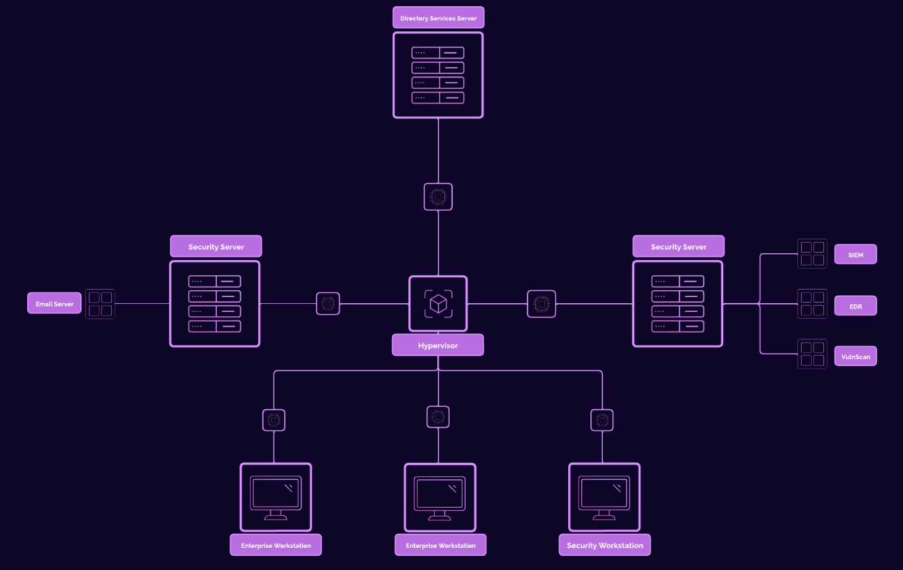

# Enterprise Cybersecurity Lab: Attack & Defense

A comprehensive enterprise-grade homelab for cybersecurity training, attack simulations, and defense monitoring.

## Project Overview

This project demonstrates the creation of a complete enterprise network environment with Active Directory, client workstations, and security monitoring to practice and demonstrate various cybersecurity concepts:

- Network infrastructure deployment with Windows Domain Controller and client machines
- Security monitoring implementation with Wazuh (SIEM/XDR)
- Attack simulation (reconnaissance, initial access, lateral movement)
- Defense capabilities and alert monitoring

## Architecture

### Network Components

| Hostname | IP Address | Function |
|----------|------------|----------|
| project-x-dc | 10.0.0.5 | Domain Controller (DNS, DHCP, SSO) |
| project-x-email-svr | 10.0.0.8 | SMTP Relay Server |
| project-x-sec-box | 10.0.0.10 | Security Monitoring Server (Wazuh) |
| project-x-win-client | 10.0.0.100 | Windows Workstation |
| project-x-linux-client | 10.0.0.101 | Linux Desktop Workstation |
| project-x-attacker | Dynamic | Kali Linux Attack Machine |

## Key Features

- **Active Directory Domain Services**: Windows Server 2025 domain controller providing centralized authentication
- **Multi-platform Clients**: Windows 11 and Ubuntu Linux clients joined to the domain
- **Email Services**: Postfix mail server for internal communication
- **Security Monitoring**: Wazuh SIEM/XDR deployment with custom detection rules
- **Deliberate Vulnerabilities**: Configured security weaknesses for attack simulation
- **Attack Demonstration**: Complete kill chain from reconnaissance to persistence

## Skills Demonstrated

- Enterprise infrastructure deployment
- Windows & Linux system administration
- Active Directory configuration and management
- Network services configuration (DNS, DHCP, SMTP)
- Security monitoring and alert configuration
- Offensive security techniques
- Defensive analysis and remediation

## Quick Start

See the [Installation Guide](docs/installation.md) for detailed setup instructions.

## Attack Simulation

The [Attack Simulation Guide](docs/attack-simulation.md) walks through a complete cyber attack scenario, from initial reconnaissance to establishing persistence.

## Security Monitoring

The [Security Monitoring Guide](docs/security-monitoring.md) details the Wazuh SIEM/XDR setup and custom alert configurations.

## License

This project is meant for educational purposes only. The techniques demonstrated should only be performed in controlled environments with proper authorization.

## Acknowledgements

This project was inspired by various cybersecurity training labs and adapted for educational purposes.