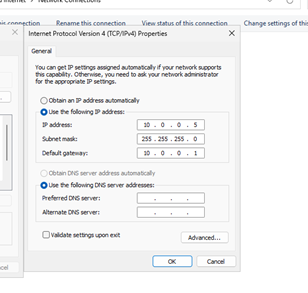
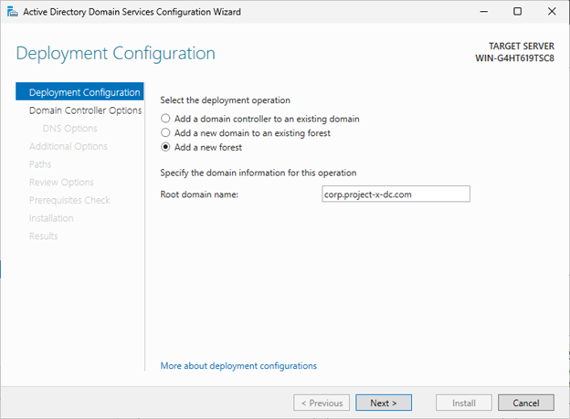

# Installation Guide

This guide provides step-by-step instructions for setting up the entire cybersecurity lab environment.

## Table of Contents
- [Installation Guide](#installation-guide)
  - [Table of Contents](#table-of-contents)
  - [Prerequisites](#prerequisites)
  - [Network Configuration](#network-configuration)
  - [Domain Controller Setup](#domain-controller-setup)
    - [Create VM](#create-vm)
    - [Install Windows Server](#install-windows-server)
    - [Install AD Domain Services](#install-ad-domain-services)
  - [Windows Client Setup](#windows-client-setup)
    - [Create VM](#create-vm-1)
    - [Install Windows 11](#install-windows-11)
  - [Linux Client Setup](#linux-client-setup)
    - [Create VM](#create-vm-2)
    - [Install Ubuntu 22.04](#install-ubuntu-2204)
  - [Email Server Setup](#email-server-setup)
    - [Create VM](#create-vm-3)
    - [Install Ubuntu Server 22.04](#install-ubuntu-server-2204)
  - [Security Monitoring Server Setup](#security-monitoring-server-setup)
    - [Create VM](#create-vm-4)
    - [Install Ubuntu 22.04](#install-ubuntu-2204-1)
  - [Kali Linux Setup](#kali-linux-setup)
    - [Create VM](#create-vm-5)
    - [Install Kali Linux](#install-kali-linux)

## Prerequisites

- VirtualBox 7.0 or higher
- At least 16GB RAM (32GB recommended)
- 250GB available disk space
- ISO files for:
  - Windows Server 2025
  - Windows 11 Enterprise
  - Ubuntu Desktop 22.04
  - Ubuntu Server 22.04
  - Security Onion
  - Kali Linux

## Network Configuration

1. Create a NAT Network in VirtualBox:
   - Name: project-x-nat
   - Network CIDR: 10.0.0.0/24
   - Enable DHCP: Yes
   - DHCP range: 10.0.0.100 - 10.0.0.200

All virtual machines are connected to the NAT Network "project-x-nat" (10.0.0.0/24) with the following IP configurations:

| VM Name | IP Address | Subnet Mask | Default Gateway | DNS Server | Function |
|---------|------------|-------------|-----------------|------------|----------|
| project-x-dc | 10.0.0.5 | 255.255.255.0 | 10.0.0.1 | 10.0.0.5 | Domain Controller |
| project-x-email-svr | 10.0.0.8 | 255.255.255.0 | 10.0.0.1 | 10.0.0.5 | Email Server |
| project-x-sec-box | 10.0.0.10 | 255.255.255.0 | 10.0.0.1 | 10.0.0.5 | Security Server (Wazuh) |
| project-x-win-client | 10.0.0.100 | 255.255.255.0 | 10.0.0.1 | 10.0.0.5 | Windows Client |
| project-x-linux-client | 10.0.0.101 | 255.255.255.0 | 10.0.0.1 | 10.0.0.5 | Linux Client |
| project-x-attacker | 10.0.0.50 | 255.255.255.0 | 10.0.0.1 | 10.0.0.5 | Attack Machine |

## Domain Controller Setup

### Create VM

1. Create a new VM in VirtualBox:
   - Name: project-x-dc
   - Type: Windows Server 2025
   - Memory: 4096 MB
   - Processors: 2
   - Hard disk: 50 GB (dynamically allocated)
   - Network: project-x-nat

### Install Windows Server

1. Install Windows Server 2025 with Desktop Experience
2. Set Administrator password: `@Deeboodah1!`
3. Configure static IP:
   - IP address: 10.0.0.5
   - Subnet mask: 255.255.255.0
   - Default gateway: 10.0.0.1
   - DNS server: 10.0.0.5



### Install AD Domain Services

1. Install server roles:
   - Active Directory Domain Services
   - DNS Server
   - DHCP Server

2. Promote to domain controller:
   - Create new forest: `corp.project-x-dc.com`
   - Set DSRM password: `@Deeboodah1!`



3. Configure DNS forwarders:
   - Add: 8.8.8.8

4. Configure DHCP scope:
   - Range: 10.0.0.100 - 10.0.0.200
   - Default gateway: 10.0.0.1

5. Create user accounts:
   - Username: johnd@corp.project-x-dc.com
   - Password: @password123!

## Windows Client Setup

### Create VM

1. Create a new VM in VirtualBox:
   - Name: project-x-win-client
   - Type: Windows 11
   - Memory: 4096 MB
   - Processors: 2
   - Hard disk: 80 GB (dynamically allocated)
   - Network: project-x-nat

### Install Windows 11

1. Install Windows 11 Enterprise
2. Set static IP:
   - IP address: 10.0.0.100
   - Subnet mask: 255.255.255.0
   - Default gateway: 10.0.0.1
   - DNS server: 10.0.0.5

3. Join domain:
   - Domain: corp.project-x-dc.com
   - Credentials: Administrator/@Deeboodah1!

## Linux Client Setup

### Create VM

1. Create a new VM in VirtualBox:
   - Name: project-x-linux-client
   - Type: Ubuntu (64-bit)
   - Memory: 2048 MB
   - Processors: 1
   - Hard disk: 80 GB (dynamically allocated)
   - Network: project-x-nat

### Install Ubuntu 22.04

1. Install Ubuntu 22.04 Desktop
2. Set static IP:
   - IP address: 10.0.0.101
   - Subnet mask: 255.255.255.0
   - Default gateway: 10.0.0.1
   - DNS server: 10.0.0.5

3. Join Active Directory domain:
   - Install Samba Winbind dependencies:
   ```bash
    sudo apt -y install winbind libpam-winbind libnss-winbind krb5-config samba-dsdb-modules samba-vfs-modules
   ```

   - Configure Samba:
   ```bash
    sudo nano /etc/samba/smb.conf
   ```

   ```
   [global]
   kerberos method = secrets and keytab
   realm = CORP.PROJECT-X-DC.COM
   workgroup = CORP
   security = ads
   template shell = /bin/bash
   winbind enum groups = Yes
   winbind enum users = Yes
   winbind separator = +
   idmap config * : rangesize = 1000000
   idmap config * : range = 1000000-19999999
   idmap config * : backend = autorid
   ```

   - Join domain:
   ```bash
   sudo net ads join -U Administrator
   ```

## Email Server Setup

### Create VM

1. Create a new VM in VirtualBox:
   - Name: project-x-email-svr
   - Type: Ubuntu (64-bit)
   - Memory: 2048 MB
   - Processors: 1
   - Hard disk: 25 GB (dynamically allocated)
   - Network: project-x-nat

### Install Ubuntu Server 22.04

1. Install Ubuntu 22.04 Server
2. Set static IP:
   - IP address: 10.0.0.8
   - Subnet mask: 255.255.255.0
   - Default gateway: 10.0.0.1
   - DNS server: 10.0.0.5

3. Install Postfix:
   ```bash
   sudo apt update
   sudo DEBIAN_PRIORITY=low apt install postfix
   ```

4. Configure Postfix:
   ```bash
   sudo postconf -e 'home_mailbox= Maildir/'
   sudo postconf -e 'virtual_alias_maps= hash:/etc/postfix/virtual'
   sudo nano /etc/postfix/virtual
   ```

   Add mapping:
   ```
   email-svr@corp.project-x-dc.com email-svr
   ```

   Apply changes:
   ```bash
   sudo postmap /etc/postfix/virtual
   sudo systemctl restart postfix
   ```

## Security Monitoring Server Setup

### Create VM

1. Create a new VM in VirtualBox:
   - Name: project-x-sec-box
   - Type: Ubuntu (64-bit)
   - Memory: 4096 MB
   - Processors: 2
   - Hard disk: 80 GB (dynamically allocated)
   - Network: project-x-nat

### Install Ubuntu 22.04

1. Install Ubuntu 22.04 Desktop
2. Set static IP:
   - IP address: 10.0.0.10
   - Subnet mask: 255.255.255.0
   - Default gateway: 10.0.0.1
   - DNS server: 10.0.0.5

3. Install Wazuh:
   ```bash
   curl -sO https://packages.wazuh.com/4.9/wazuh-install.sh && sudo bash ./wazuh-install.sh -a -i
   ```

## Kali Linux Setup

### Create VM

1. Create a new VM in VirtualBox:
   - Name: project-x-attacker
   - Type: Debian (64-bit)
   - Memory: 2048 MB
   - Processors: 1
   - Hard disk: 55 GB (dynamically allocated)
   - Network: project-x-nat

### Install Kali Linux

1. Install Kali Linux
2. Set username/password: attacker/attacker
